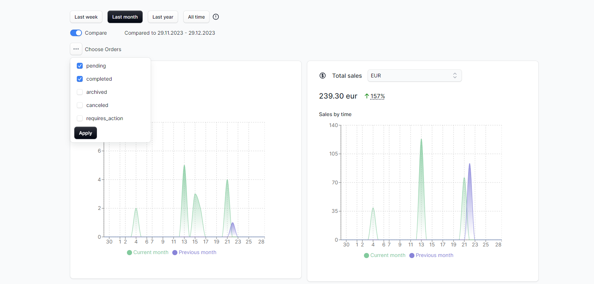
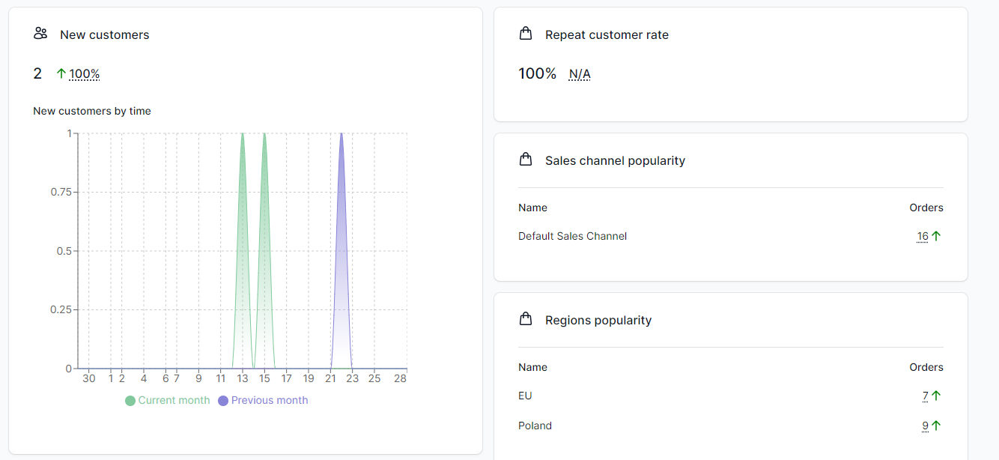

<p align="center">
  <picture>
    
  </picture>
</p>

<h1 align="center">
  Medusa store-analytics
</h1>

Medusa "store-analytics" is a plugin which shows analytics data of your store, including orders, sales and other useful information.

### Why?

Knowledge about your store is crucial to take proper action to increase the sales. Analytics data can show various things like what is a most popular region, sales channel or on which day people are buying the most. Every such data may help to find problem and possible solutions. 

## Getting Started

1. Install the package with `yarn add @rsc-labs/medusa-store-analytics` or `npm i @rsc-labs/medusa-store-analytics`.
2. In `medusa-config.js`, add the plugin to the `plugins` array and set `enableUI`

```js
const plugins = [
  // ... other plugins
  {
    resolve: `@rsc-labs/medusa-store-analytics`,
    options: {
      enableUI: true
    }
  }
]
```


## How can I use it?

After installation of plugin, you shall be able to see new option on sidebar. Click `Analytics` and see data about your store.

<p align="center">
  <picture>
    
  </picture>
</p>

**WARNING**:

Depends on the number of your orders, customers and other - it might take a while to load them all if you click wider options like `Last year` or `All time`!

### Configuration

No configuration is needed. Everything is done through UI. You can use such options like:
- set different range for dates
- set different statuses of orders for calculation
- enabling/disabling comparison feature

<p align="center">
  <picture>
    
  </picture>
</p>

<p align="center">
  <picture>
    
  </picture>
</p>

## Supported statistics

### General

| Name | Status |
| --- | --- |
| 4 ranges of dates | :white_check_mark: |
| Comparison across date ranges | :white_check_mark: |
| Filtering by orders' status | :white_check_mark: |

### Orders

| Name | Status |
| --- | --- |
| Orders by time | :white_check_mark: |
| Orders chart | :white_check_mark: |
| Regions popularity | :white_check_mark: |
| Sales channel popularity | :white_check_mark: |

### Sales

| Name | Status |
| --- | --- |
| Sales by time | :white_check_mark: |
| Sales by currency code | :white_check_mark: |
| Sales chart | :white_check_mark: |

### Customers


| Name | Status |
| --- | --- |
| New customers by time | :white_check_mark: |
| Repeat customer rate | :white_check_mark: |
| Customers chart | :white_check_mark: |

### Products

| Name | Status |
| --- | --- |
| Top variants sold by orders | :white_check_mark: |

## License

MIT

---

© 2024 RSC https://rsoftcon.com/
