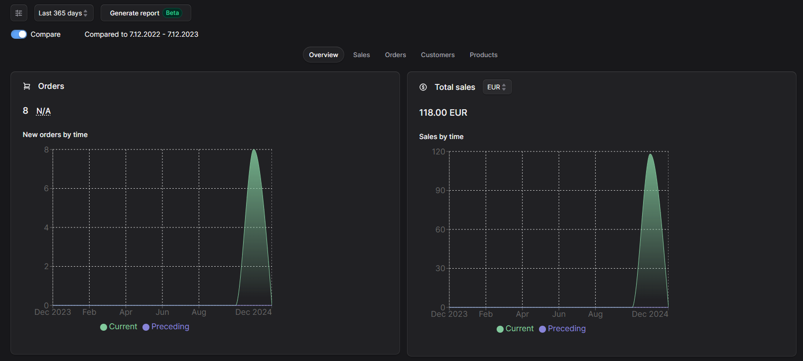
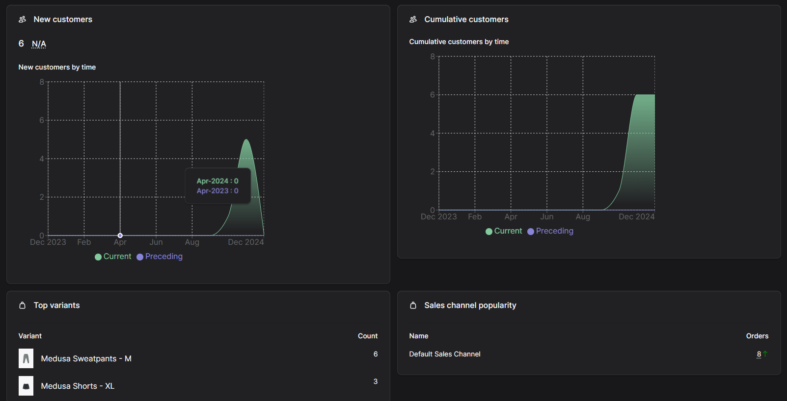

Medusa "store-analytics" is a plugin which shows analytics data of your store, including orders, sales and other useful information.

### Why?

Knowledge about your store is crucial to take proper action to increase the sales. Analytics data can show various things like what is a most popular region, sales channel or on which day people are buying the most. Every such data may help to find problem and possible solutions. 

## Getting Started

### Plugin system

Plugins are not yet supported in Medusa 2.0, so this part is TODO.

### Copy the code

You can copy the code from /src into your Medusa project.

Add module to your `medusa-config.js` file:

```js
{
  // If you copied the code
  resolve: "./modules/store-analytics"
}
```

## How can I use it?

After installation of plugin, you shall be able to see new option on sidebar. Click `Analytics` and see data about your store.

<p align="center">
  <picture>
    
  </picture>
</p>

**WARNING**:

Depends on the number of your orders, customers and other - it might take a while to load them all if you click wider options like `Last year` or `All time`!

### Configuration

No configuration is needed. Everything is done through UI. You can use such options like:
- set different range for dates
- set different statuses of orders for calculation
- enabling/disabling comparison feature

<p align="center">
  <picture>
    
  </picture>
</p>

## Supported statistics

### General

| Name | Status |
| --- | --- |
| 4 ranges of dates | :white_check_mark: |
| Comparison across date ranges | :white_check_mark: |
| Filtering by orders' status | :white_check_mark: |

### Orders

| Name | Status |
| --- | --- |
| Orders by time | :white_check_mark: |
| Orders chart | :white_check_mark: |
| Regions popularity | :white_check_mark: |
| Sales channel popularity | :white_check_mark: |
| Orders frequency distribution | :white_check_mark: |
| Payment provider popularity | :white_check_mark: |

### Sales

| Name | Status |
| --- | --- |
| Sales by time | :white_check_mark: |
| Sales by currency code | :white_check_mark: |
| Sales chart | :white_check_mark: |
| Refunds | :white_check_mark: |

### Customers


| Name | Status |
| --- | --- |
| New customers by time | :white_check_mark: |
| Repeat customer rate | :white_check_mark: |
| Customers chart | :white_check_mark: |
| Cumulative customers by time | :white_check_mark: |

### Products

| Name | Status |
| --- | --- |
| Top variants | :white_check_mark: |
| Top returned variants | :white_check_mark: |
| Products sold count | :white_check_mark: |
| Out of the stock variants | BETA |

### Marketing

| Name | Status |
| --- | --- |
| Top discounts | :white_check_mark: |

## License

MIT

## Pro version

The Pro version of medusa-store-analytics expands on the features of the free version with more advanced capabilities such as 
- customizable dashboard - you can create your own dashboard with chosen statistics
- date range picker - choose whatever date range to see statistics exactly for this range
- more than 15 new, advanced statistics - funnels, deep insights about promotions or granular statistics per sales channels.

The Pro version is available under commercial licence - contact labs@rsoftcon.com for more information.

### Hide Pro version tab

We show what advanced features we offer in "Pro version" tab. We tried to keep it non-intruisive, but if you feel it differently, you can always hide this tab by setting following environment variable:
`VITE_MEDUSA_ADMIN_MEDUSA_STORE_ANALYTICS_HIDE_PRO=true`

After restarting your admin application, you shall have this tab hidden.

---

© 2024 RSC https://rsoftcon.com/
